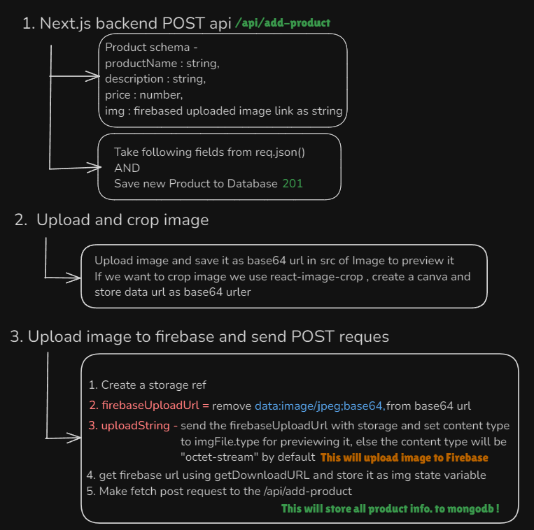
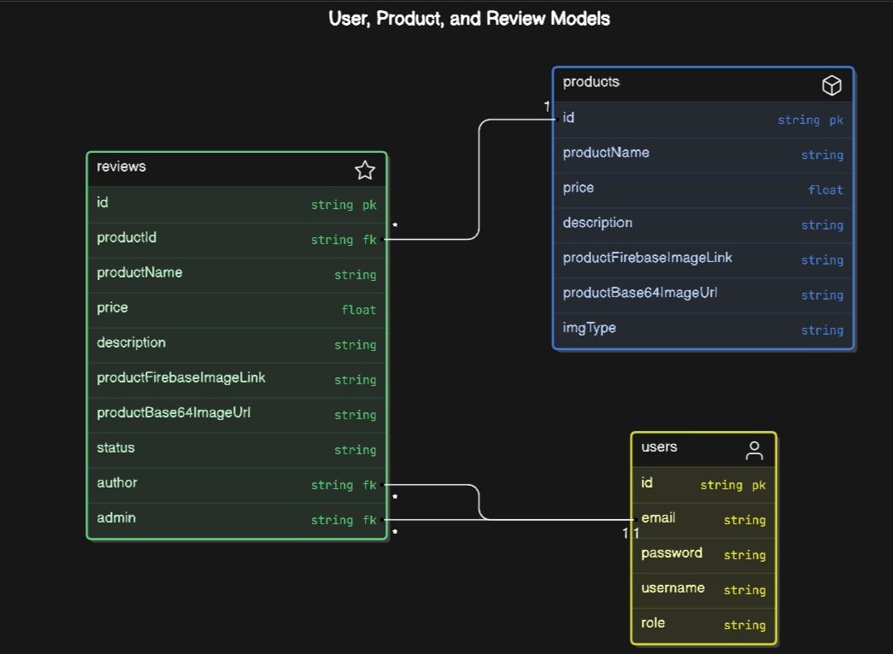

# Ply picker task

## Tech stack used 

- **Next.js + TypeScript** - For frontend and backend
- **Mongoose + MongoDB** - For database and ODM
- **Zustand** - For persistant Global state management
- **react-image-crop** - For implementing image crop
- **Firebase cloud storage** - to store images in cloud
- **Shadcn UI + Tailwind CSS** - For UI styling

## Routes - 

### API Routes - 

- `api/add-product` - To add product as admin
- `api/delete-product` - To delete product as admin
- `api/edit-product` - To edit product as admin
- `api/get-product` - To get product with id
- `api/get-products` - To get all product 
- `api/admin-recent-reqs` - fetch recent approved/rejected requests of admin in array with limit 5
- `api/approve` - Approve changes as admin
- `api/reject` - Reject changes as admin
- `api/pending-requests` -  get all pending requests as admin
- `api/pending-requests/[requestId]` -  get a particular request id. 
- `api/my-submissions` - get all submissions of team memeber
- `api/submit-review` - To submit product for changes
- `api/review-stats` - To review stats of admin like total requests recived, approved and reject
- `app/team-member-stats` - To see stats of team member , ie , num of reqs he made, reqs that got approved / rejected
- `app/login` - login user based on role
- `app/register` - register user based on role

### App routes

All `app/dashboard` routes - 

- /add - add product
- /my-submissions - get all submissions for team memeber
- `/my-submissions/[submissionId]` - review particular submission for team memeber
- /pending-requests - get all pending requests for the admin
- `/pending-requests/[reqId]` - get a particular request and accept / reject it for admin
-/products  -  GET all products
- `/product/product/[id]` - get a particular product and perform edits based on role


## Work flow Diagrams

### Upload and Croping mechanism



### Model Relations



## Issues


### State Persistance issue
### Documentation: Understanding and Solving Hydration Issues in Next.js 14

#### **What is Hydration in Next.js?**

**Hydration** is the process by which Next.js takes the static HTML content that was pre-rendered on the server and converts it into a fully interactive React application on the client side. During hydration, React attaches event handlers and reconciles the static HTML with the dynamic state-driven components.

This process is crucial because it ensures that the initial page load is fast (thanks to server-side rendering) while still allowing the page to become interactive with React once it reaches the client. However, for hydration to work smoothly, the HTML generated on the server must exactly match what React expects on the client. If there’s any discrepancy, such as differences in state or content based on client-only data like `localStorage`, it can lead to a **hydration error** or brief incorrect rendering.

#### **Issue Description**

The issue I faced was as follows:
- **Correct Rendering After Login:** Initially, after logging in, the `NavBar` showed the correct content because I had an effect in `app/page.tsx` that fetched the user data from `localStorage`.
- **Incorrect Rendering on Route Changes or Page Refresh:** However, when navigating to other routes or refreshing the page on routes other than the root `/`, the `NavBar` would briefly display the wrong content. It appeared as if the user was not logged in, even though they were. After about 0.5 to 1 second, the `NavBar` would update and show the correct content.

This brief period of incorrect content was due to the delay between the initial server-rendered HTML and the client-side JavaScript that fetched and updated the user state.

#### **Cause of the Issue**

The issue was caused by the way Next.js handles server-side rendering (SSR) and client-side hydration:
- **Server-Side Rendering:** When the page is initially rendered on the server, it doesn’t have access to `localStorage` or other client-only APIs. As a result, the HTML sent to the client reflects a state that might not match the actual state on the client.
- **Client-Side Hydration:** Once the page reaches the client, React hydrates the HTML by attaching event handlers and updating the state. However, if there’s a delay in fetching the client-side data (e.g., from `localStorage`), the UI might briefly display outdated or incorrect content.

In my case, the `NavBar` was rendered with server-side HTML that didn’t have the user information from `localStorage`. Once the page was hydrated and the `useEffect` hook ran, the `NavBar` updated to reflect the correct user state. This caused the brief flicker of incorrect content.

#### **Solution**

To solve this issue, I made the following adjustments:

1. **Use `useEffect` for Client-Side Logic:**
   I added a `useEffect` hook in the `NavBar` component to ensure that the user state is rehydrated from `localStorage` on the client side. This ensured that the `NavBar` would always display the correct content after hydration.

   ```javascript
   useEffect(() => {
    // fetch user functionality
     const storedUser = localStorage.getItem("logedin-user");
     if (storedUser) {
       setUser(JSON.parse(storedUser));
     }
   }, [setUser]);
   ```

2. **Rehydration and State Synchronization:**
   By using `useEffect`, I ensured that the client-side state was always synchronized with what was stored in `localStorage`. This minimized the chances of displaying incorrect content during the brief hydration period.

3. **Brief Incorrect Display:**
   While the `useEffect` approach solved the main issue, there might still be a brief moment where the wrong content is displayed. This is because the server-rendered HTML is used until the client-side JavaScript updates the state. However, this flicker is now much shorter and less noticeable.


For more information on hydration issues and how to resolve them, you can refer to the following resources:
- [Next.js Documentation on Hydration Errors](https://nextjs.org/docs/messages/react-hydration-error)
- [Fixing Hydration Issues in Next.js](https://brockherion.dev/blog/posts/nextjs-fixing-hydration-issues-with-zustand)【16†source】
- [Handling Hydration in Next.js](https://nextjsstarter.com/blog/hydration-errors)【15†source】.
